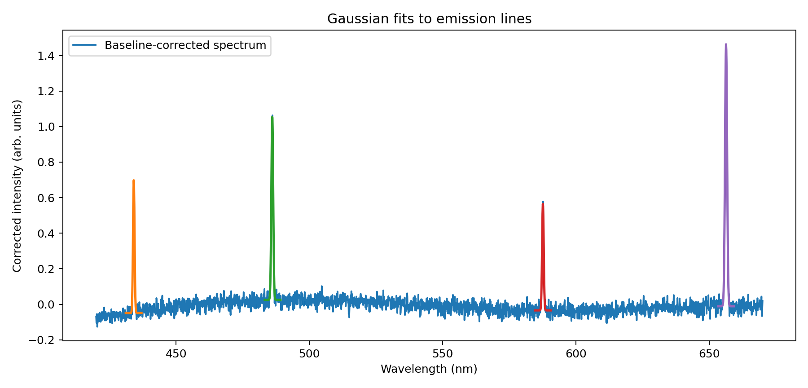
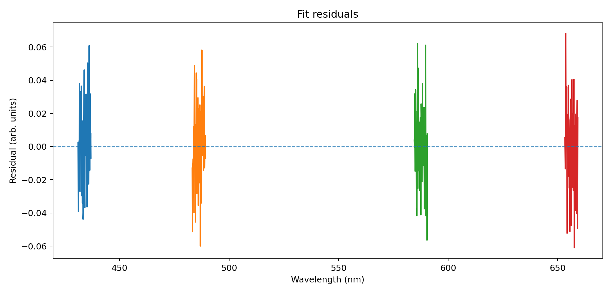

# Plasma Spectroscopy Analysis

A small scientific Python project for analysing emission spectra using peak detection and Gaussian fitting. This project connects numerical data analysis with basic physical interpretation of spectral lines, with applications in plasma physics, astrophysics and radiation analysis.



## Goal

The goal of this project is to build a simple and reproducible pipeline for analysing emission spectra. The analysis focuses on identifying spectral lines, fitting them with Gaussian profiles, extracting relevant parameters and interpreting them from a physical point of view.

## Motivation

I chose this project because I am interested in plasma physics, spectroscopy, nuclear fusion and astrophysics. I think spectral line analysis is a simple but realistic way to connect scientific programming with physical interpretation.

## Physics background

Emission spectra contain peaks at specific wavelengths. These peaks are associated with radiative transitions in atoms, ions or molecules. In plasma physics and astrophysics, spectral lines can provide information about the physical conditions of the emitting system. In this project, each spectral line is approximated using a Gaussian profile. From the fitted profile, we can estimate:

* the central wavelength of the line
* the line amplitude
* the line width
* the integrated intensity
* the residuals of the fit

The central wavelength can also be related to the photon energy using:

$$
E = \frac{hc}{\lambda}
$$

where (h) is Planck's constant, (c) is the speed of light and $\lambda$ is the wavelength of the fitted spectral line.

Using hc = 1239.84 $\mathrm{eV·nm}$, the photon energy in electronvolts can be estimated from:

$$
E(eV) = \frac{1239.84}{\lambda·nm}
$$

## Data source

The spectrum used in this project is synthetic. It was generated to reproduce the basic structure of an emission spectrum with several emission-like peaks and a small amount of noise.

The aim is not to claim that these are experimental plasma measurements, but to build and test a reproducible analysis workflow before applying the same structure to real experimental or public spectral data.

## Methods

The analysis follows these steps:

1. Load the synthetic emission spectrum.
2. Apply a simple offset correction by subtracting the minimum intensity value.
3. Visualise the raw and corrected spectra.
4. Select the main emission lines.
5. Fit each selected line with a Gaussian profile.
6. Extract fitted parameters such as line centre, width, amplitude and area.
7. Estimate photon energies from the fitted wavelengths.
8. Analyse the residuals of the fits.
9. Save the resulting figures and fitted parameters.

## Main features

* Synthetic emission spectrum analysis
* Simple offset correction
* Gaussian fitting with SciPy
* Photon energy estimation
* Residual analysis
* Scientific plotting with Matplotlib
* Reproducible Jupyter Notebook workflow
* Modular Python helper functions

## Repository structure

```text
plasma-spectroscopy-analysis/
│
├── README.md
├── requirements.txt
├── 01_analysis.ipynb
│
├── sample_spectrum.csv
├── fit_results.csv
│
├── fitting.py
├── plotting.py
├── preprocessing.py
│
├── spectrum_baseline.png
├── spectrum_fit.png
└── residuals.png
```

## Results

The analysis produces fitted Gaussian profiles for the selected spectral lines. From these fits, the central wavelength, width and integrated intensity of each line are estimated.

The results table also includes a rough estimate of the Doppler temperature. This value should be interpreted only as a simplified teaching estimate, because it assumes that the measured line width is entirely due to thermal Doppler broadening. Real spectra would also include instrumental, Stark, pressure and other line-broadening mechanisms.

The fitted line centres are then converted into photon energies, which connects the numerical fit parameters with the physical energy scale of the emitted radiation.



The residuals provide a simple way to check how well the Gaussian model describes each selected spectral line. Small residuals indicate that the Gaussian approximation is reasonable for this synthetic dataset.

## How to run

Clone the repository:

```bash
git clone https://github.com/helenajurado/Plasma-Spectroscopy-Analysis.git
cd Plasma-Spectroscopy-Analysis
```

Install the required Python packages:

```bash
pip install -r requirements.txt
```

Open the Jupyter Notebook:

```bash
jupyter notebook 01_analysis.ipynb
```

Then run the notebook cells in order.

## Requirements

This project uses:

* Python
* NumPy
* pandas
* SciPy
* Matplotlib
* Jupyter Notebook

## What I learned

This project helped me practise the basic structure of a scientific Python analysis: loading data, applying a preprocessing step, fitting a mathematical model, extracting physical quantities and presenting the results in a reproducible way.

The most useful part was connecting numerical fit parameters with physical ideas such as photon energy, wavelength shifts and spectral line broadening. I also learned that a simple model can be useful as a first step, but that real spectroscopy would require a more careful treatment of noise, calibration and broadening mechanisms.

## Limitations

This is an introductory project based on synthetic data. The current model assumes isolated Gaussian line profiles and uses a simple offset correction rather than a complete background subtraction method.

Real plasma or astrophysical spectra may require additional steps, such as:

* wavelength calibration,
* uncertainty estimation,
* instrumental broadening correction,
* Doppler broadening analysis,
* Stark or pressure broadening analysis,
* comparison with known atomic databases,
* treatment of overlapping spectral lines.

Therefore, this project should be understood as a first reproducible spectroscopy workflow, not as a complete plasma diagnostic tool.

## Future improvements

Possible extensions include:

* applying the same workflow to real experimental or public spectral data,
* comparing Gaussian, Lorentzian and Voigt line profiles,
* adding uncertainty estimates to the fitted parameters,
* improving the baseline correction method,
* identifying spectral lines using atomic databases,
* estimating plasma temperature from line ratios,
* writing a short LaTeX report based on the notebook results.

## Status

This is an initial version of the project. The main goal is to build a clean and understandable scientific Python workflow that can be improved over time.
